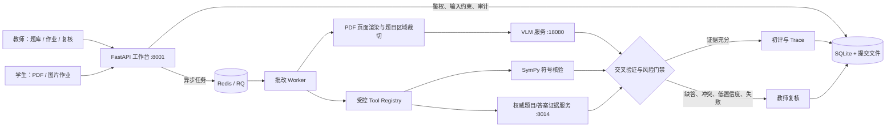

# 可验证 AI Agent 工作台

> 以高等数学作业批改为真实场景的 Agent Harness：让模型输出经过确定性验证、独立求解、交叉仲裁、失败降级与人工复核后，才影响成绩。

[](https://github.com/YingXingZ/math_agent/actions/workflows/agent-regression.yml)

这个仓库不是“把题目交给大模型、直接返回分数”的 Demo。它关注高风险 Agent 的运行时工程问题：不可信输入如何隔离、工具如何受控调用、模型与上游失败时系统如何安全退化，以及怎样将每次决定保留为可复核证据。

## 三分钟了解项目

1. **教师发布作业**：从经过核验的题库抽取原题或指定小问，生成学生可提交的作业。
2. **学生提交与异步批改**：PDF/图片作业进入 Redis/RQ 队列；PDF 会按题目实际区域裁切，避免把整页答案误配给每个小问。
3. **确定性优先的判定**：优先使用 SymPy 等可复现工具核验；证据不足时才调用视觉模型独立求解，且独立求解阶段不提供标准答案。
4. **分层决策**：交叉验证一致且风险低的结果可作为初评参考；缺答、识别异常、表达式无法确认、结果冲突等情形进入教师复核，系统不会将其自动放行为满分。
5. **可解释与可回归**：每题保存来源题号、裁切证据、路线、工具 Trace、置信度、错误码和人工裁定；固定评测集与 GitHub Actions 防止修改后回归。

完整架构见 [docs/ARCHITECTURE.md](docs/ARCHITECTURE.md)，90 秒演示流程见 [docs/DEMO.md](docs/DEMO.md)。

## 架构



## 核心可靠性设计

| 风险 | 系统行为 |
| --- | --- |
| 手写答案不完整 / 小问缺失 | 完成度门禁阻止满分；缺失小问单独进入复核。 |
| OCR 或题目定位不确定 | 保留 PDF 原题区域与裁切证据；不把整页内容当作每道题答案。 |
| 数学解析不能确认等价 | 不以“解析失败”直接判错或判对，降级为待核验。 |
| VLM 超时、5xx、连接失败、异常 JSON | 规范化为可追踪失败，任务安全失败或转教师复核，不返回伪造分数。 |
| 模型输出字段类型异常 | 分数/置信度归零、标记 `need_review`，避免 500 导致整个任务丢失。 |
| Prompt Injection / 不可信 OCR 文本 | 输入检测、固定路由、Tool 白名单和参数校验；不可信文本不会改变工具权限。 |

## 快速开始

本仓库支持两种启动路径：本地开发（不依赖 GPU）和完整批改部署（需要 Redis、8014 证据服务及 VLM）。请先复制环境模板，真实密码、Cookie 密钥和服务密钥绝不提交到 Git。

```bash
git clone https://github.com/YingXingZ/math_agent.git
cd math_agent/src/agent8000
cp .env.example .env                 # Windows PowerShell: Copy-Item .env.example .env
python -m venv .venv
# Linux/macOS
source .venv/bin/activate
# Windows PowerShell
# .\.venv\Scripts\Activate.ps1
pip install -r requirements.txt
uvicorn app.main:app --reload --port 8001
```

访问 `http://127.0.0.1:8001/docs` 查看 API。开发环境默认使用安全的 inline 队列；真实自动批改请使用生产 Compose 或服务器 systemd 服务，避免在 Web 请求中长时间执行模型调用。

### 生产部署（Docker Compose）

```bash
cd src/agent8000/deploy
cp .env.production.example .env.production
# 填入随机生成的密钥、HTTPS 域名及受控的内部服务地址
docker compose --env-file .env.production up -d --build
docker compose ps
curl -fsS http://127.0.0.1:8001/healthz
```

Compose 会启动 API、RQ Worker、Scheduler 和 Redis；VLM 与 8014 证据服务应部署在仅内网可达的位置。更完整的操作说明见 [src/agent8000/DEPLOYMENT.md](src/agent8000/DEPLOYMENT.md)。

## 验证与质量门禁

```bash
# 在仓库根目录，Python 3.12
python -m pytest src/agent8000/tests src/workbench8014/tests src/tools/test_langgraph_math_agent.py -q
python src/agent8000/scripts/release_quality_gate.py
python src/workbench8014/evals/run_eval.py
python src/workbench8014/evals/run_real_case_eval.py
python src/workbench8014/evals/run_prompt_injection_eval.py
```

CI 对 PR 和 `master` 推送执行相同回归，并上传教师标注评测报告。评测集覆盖正确、错误、空白、部分完成、模糊识别和等价写法等高风险场景；详见 [docs/agent-evaluation-baseline.md](docs/agent-evaluation-baseline.md)。

## 代码地图

| 路径 | 职责 |
| --- | --- |
| `src/agent8000/app/` | 教师/学生工作台、鉴权、作业、异步批改编排与审计。 |
| `src/vlm18080/` | 本地视觉语言模型服务；对异常模型输出进行安全降级。 |
| `src/workbench8014/` | 题目、答案与证据的权威服务；Skill Registry、独立求解、交叉验证与学习 Trace。 |
| `src/agent8000/evals/`、`src/workbench8014/evals/` | 固定评测、红队输入和发布质量门禁。 |
| `tests/`、`src/**/tests/` | 集成、鉴权、题目定位、LaTeX、队列与回归测试。 |
| `docs/` | 架构、Demo、评测基线和诊断文档。 |

## 安全与数据边界

- 默认要求登录；教师、学生与管理员端点按角色限制。
- 生产环境必须启用 HTTPS、`COOKIE_SECURE=true`、强随机密钥与受控 CORS 来源。
- 学生作业、SQLite 数据库、上传文件、模型密钥和 `.env` 均不应提交 Git。
- 本项目适用于课程试点与研究；正式大规模部署前仍应迁移到并发数据库、补充备份/告警与学校隐私合规流程。

## 当前范围与路线图

已完成：题目区域级批改、原始题号回显、LaTeX 安全渲染、缺答拦截、异步 RQ 批改、Prompt Injection 防护、工具 Trace、固定评测与 CI。

正在优先推进：统一失败语义、服务鉴权/CORS 收紧与核心回归覆盖。后续路线包括 checkpoint/resume、幂等重试、性能/成本指标、并发批改和教师反馈回流评测。

## 贡献与复现原则

提交前请运行测试与质量门禁；不要提交真实学生作业、数据库、API Key、模型权重或含个人信息的截图。问题复现请尽量提供脱敏 PDF/图片和对应 Trace，而不是直接上传真实班级数据。
