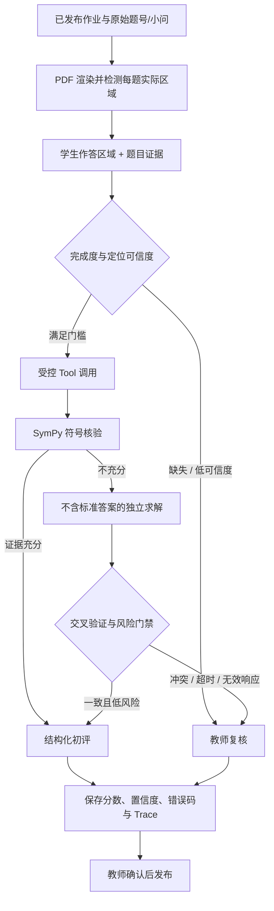

# 架构与决策边界

## 目标

系统处理的是会影响学生成绩的高风险判断，因此设计目标不是最大化自动判分比例，而是在证据不足时**可靠地停止自动判定**。任何自动初评都应能回溯到原题、学生作答区域、工具调用和路由原因。

## 服务边界

| 服务 | 责任 | 不负责 |
| --- | --- | --- |
| `agent8000` | 登录、作业生命周期、上传、队列投递、教师复核、成绩发布与审计 | 直接在 HTTP 请求中执行耗时模型批改 |
| RQ Worker / Scheduler | 截止任务、批改任务和中断后的队列恢复 | 用户鉴权与浏览器响应 |
| `vlm18080` | 从题目区域与学生区域识别作答、独立解题、给出结构化候选 | 在无可靠证据时决定最终成绩 |
| `workbench8014` | 权威题干/答案证据、Skill Registry、符号核验、交叉验证和 Agent Trace | 接受来自公网的匿名请求 |
| Redis | 承载可重试的异步任务 | 保存成绩权威数据 |

## 单题决策流程

### 不变量

1. 原始题号和小问是成绩记录的主键语义；界面序号不能替代它。
2. 一道题若含多个小问，所有要求的小问都必须被检查；不可用单一正确小问覆盖整题满分。
3. 独立求解与标准答案隔离，之后才做交叉验证。
4. 模型、OCR、数学工具或上游服务不能确认时，结果必须携带失败/风险原因并进入复核，而不是猜测。
5. 教师确认是成绩发布的最终授权；自动初评仅是可审查建议。

## 可观测性

每次学习 Agent 调用保存 `trace_id`、Skill 版本、路线、工具耗时、成功标记、错误码和是否需要教师复核。教师可从工作台报告接口查询近期 Trace；测试与发布门禁使用固定样本集防止已修复场景回退。

## 外部输入与信任级别

| 输入 | 信任级别 | 处理方式 |
| --- | --- | --- |
| 教师确认发布的题目与答案 | 高 | 作为证据来源，仍保留版本/来源定位。 |
| 学生上传、OCR 文本、手写识别 | 不可信 | 文件类型/大小限制、注入检测、只传给固定允许的路线。 |
| VLM 输出 | 不可信候选 | schema/类型/完成度检查；异常时降级复核。 |
| 教师确认分 | 权威 | 写入审计记录后才可向学生发布。 |

## 部署拓扑

生产配置使用私网绑定：浏览器只经 HTTPS 反向代理访问 API；Redis、VLM 与 8014 不对公网开放。服务间认证和 CORS 规则由环境变量配置，密钥只驻留服务器环境文件。
